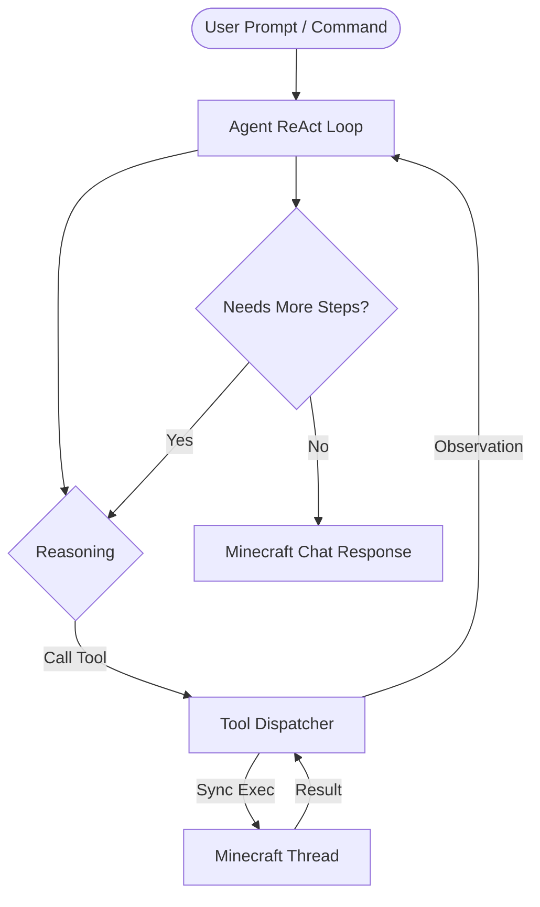

# 🤖 G1axMinecraftAssistant

[](https://fabricmc.net/)
[](https://fabricmc.net/)
[](https://creativecommons.org/publicdomain/zero/1.0/)

An autonomous, tool-using AI agent client mod for Minecraft **1.21.x Fabric**. G1axMinecraftAssistant brings advanced reasoning capability directly inside your client, enabling game state awareness, real recipe calculation, mod config editing, performance analysis, and automated optimization.

**Created by G1ax**  
* GitHub: [github.com/AkaTriggered](https://github.com/AkaTriggered)  
* Discord: DM **g1.ax** for custom client/server mods (paid commissions only)

---

## 🎬 See It In Action

The grey `»` lines are the agent narrating each tool call **live** as it works.

**You:** `/mcai how do I craft a hopper, and what am I missing?`
```
» get_inventory
» lookup_recipe: hopper
» check_craftable: hopper
[G1axAssistant] A hopper needs 5 iron ingots + 1 chest.
You have 2/5 iron ingots and 1 chest ✓.
Missing: 3 iron ingots — smelt iron ore (Y -16 to 64) in a furnace.
```

**You:** `/mcai trust on` then `/mcai just give me the iron I'm missing`
```
» check_craftable: hopper
» run_command: /give @s minecraft:iron_ingot 3
[G1axAssistant] Done — gave you 3 iron ingots. Your hopper is craftable now. ✅
```

**You:** `@ai what's around me and how's my FPS?`
```
» get_player_state
» get_nearby_entities r=16
» get_performance
[G1axAssistant] You're at (124, 71, -488) in a plains biome, daytime.
Nearby: 3 cows, 1 creeper (12.4 blocks away). FPS 142, RAM 2.1/4 GB, 8 cores.
```

> Notice the **chain**: one prompt → several tool calls → a grounded answer. The agent decides the chain itself.

---

## ⚡ Why this isn't "just another AI chat mod"

| Plain AI chat mod | 🤖 G1axAssistant |
| :--- | :--- |
| Guesses your inventory | **Reads** your real inventory, armor & offhand |
| Hallucinates recipes | Pulls **real recipes** from the game's `RecipeManager` |
| One request → one reply | **Multi-step loop**: observe → think → act → repeat |
| Can only talk | Can **run commands**, send chat, edit configs |
| Forgets instantly | **Remembers** the conversation (`/mcai reset` to clear) |
| Dies on rate limits | **Auto-retries** with backoff, falls back to a second provider |

---

## 🧭 How the Agent Works (ReAct Loop)

Unlike simple chat bots that only respond with pre-baked instructions, G1axMinecraftAssistant operates as a **ReAct (Reasoning and Acting) Agent**. 

When you ask a question or issue a command:
1. **Thought**: The agent reasons about what data it needs or what action is required.
2. **Action**: The agent chooses and executes one or more tools (e.g., fetching inventory, reading configs, looking up recipes).
3. **Observation**: The agent reads the output from the tool.
4. **Repeat**: It iterates this loop (up to a configurable step budget, default 8) until it has gathered enough information to construct a final response.



> [!NOTE]
> Any tool execution that interacts with live game states (such as reading the player's inventory, looking at a targeted block, or executing server commands) automatically schedules itself on the main Minecraft client thread using a custom client runner (`MinecraftThread.java`). This prevents thread collisions and ensures game stability.

---

## 🛠️ Complete Tools Reference

The agent utilizes a rich suite of built-in tools divided into four core modules:

### 1. Game State Observation (`GameStateTools`)
Read-only observations that ground the agent in your current world.

| Tool Name | Parameters | Description |
| :--- | :--- | :--- |
| `get_inventory` | None | Fetches player's inventory as a JSON map of `item_id -> count`. Includes hotbar, main inv, armor, and offhand. |
| `get_player_state` | None | Gets player position `(x, y, z)`, current dimension, biome, health, food level, XP, game mode, facing direction, and foot light level. |
| `get_world_info` | None | Returns the current time (in ticks), day/night phase, weather conditions, and world difficulty. |
| `get_nearby_entities`| `radius` (int, max 64) | Scans for mobs, players, and items within a sphere, sorted by proximity. |
| `look_at_block` | None | Targets the block in your crosshairs and returns its ID and coordinates. |

### 2. Synced Recipe Introspection (`RecipeTools`)
Accesses the real recipe registry from your client.

- **`lookup_recipe`**: Reads Minecraft's active `RecipeManager` to get exact recipes, outputs, and alternative ingredients.
- **`check_craftable`**: Compares recipe ingredients against your live inventory and returns exactly what you have vs. what you need.

> [!TIP]
> Because the mod reads the active `RecipeManager` at runtime, it supports custom recipes and modded items automatically. If a recipe is not found in the registry, the agent gracefully falls back to its general knowledge base.

### 3. System & Optimization (`SystemTools`)
Manages performance diagnostics and edits local configurations.

- **`get_performance`**: Gathers current FPS, RAM usage, total RAM, CPU cores, render distance, and graphics mode.
- **`list_mods`**: Lists all installed Fabric mods and versions.
- **`list_configs`**: Scans the `config/` directory and lists files ending in `.json`, `.properties`, or `.toml`.
- **`read_config`**: Reads the full content of a configuration file relative to the config directory.
- **`write_config`**: Overwrites a config file. (Requires Trust Mode).
- **`scan_logs`**: Summarizes recent error and warning lines in `logs/latest.log`.
- **`scan_crashes`**: Finds the latest crash report and extracts the primary stacktrace error.

> [!WARNING]
> To protect your setups, `write_config` creates a timestamped copy inside `config/g1ax_backups/` before applying any modifications.

### 4. World Interaction (`ActionTools`)
Allows the agent to act on behalf of the player.

- **`run_command`**: Runs a server/client command. (Excludes the leading slash).
- **`send_chat`**: Sends a message to public chat.

---

## 🔒 Safe Mode vs. Trust Mode

By default, the mod operates in **Safe Mode** to prevent the AI from modifying files or running commands without your consent.

* **Safe Mode (Trust OFF)**: If the agent attempts an action tool (`run_command`, `send_chat`, `write_config`), the execution is intercepted. The tool returns a preview error to the agent, which then informs you exactly what action it wanted to take and instructs you to enable trust if desired.
* **Trust Mode (Trust ON)**: The agent executes actions directly.

> [!IMPORTANT]
> The configuration also includes hard switches (`allowCommands` and `allowChat`). If set to `false`, the agent can never run commands or send chat, even if Trust Mode is enabled.

---

## 💬 Command Directory

All mod features are accessible via `/mcai` commands in-game:

```
/mcai <message>              - Query the agent with a custom prompt
@ai <message>                - Ask the agent directly inside public chat
/mcai config                 - Opens the config GUI screen
/mcai toggle                 - Enable/disable the AI listener
/mcai reset                  - Clears the conversation memory context
/mcai status                 - Shows active LLM provider, keys status, and trust mode
/mcai trust <on|off>         - Allows or previews in-game actions
/mcai key <groq|gemini> <key> - Configures your API key via chat command
/mcai provider <auto|groq|gemini> - Pick provider preference
/mcai analyze                - Triggers performance analysis and settings diagnostics
/mcai optimize <level>       - Applies performance preset (low | medium | high)
/mcai list mods              - Prints all loaded mods in chat
/mcai list configs           - Prints all config files in the config folder
/mcai about                  - Displays credits and mod version details
```

---

## ⚙️ Configuration Screen

Use `/mcai config` to open the GUI configuration screen:

* **Groq API Key**: Set your key for Groq Cloud.
* **Gemini API Key**: Set your key for Google AI Studio.
* **Provider Selection**: Set to `auto` (failover), `groq`, or `gemini`.
* **Trust Button**: Easily toggle safe mode vs trust mode.

---

## 🚀 Setup & Installation

1. Place the mod `.jar` file inside your Minecraft **`.minecraft/mods`** folder.
2. Ensure you have the **Fabric API** installed.
3. Launch Minecraft and log in to a world.
4. Run `/mcai config` and paste your API keys. Get keys for free:
   - **Groq API Key**: [console.groq.com](https://console.groq.com/)
   - **Gemini API Key**: [aistudio.google.com/app/apikey](https://aistudio.google.com/app/apikey)
5. Save the configuration and begin chatting!

> 💡 You can set **both** keys. With `provider auto`, Groq runs first and Gemini automatically covers for it if Groq is rate-limited.

---

## 🔌 Providers & Models

The agent is provider-neutral and uses **native function-calling** on both backends.

| Provider | Default model | Get a free key | Notes |
| :--- | :--- | :--- | :--- |
| **Groq** | `llama-3.3-70b-versatile` | [console.groq.com](https://console.groq.com/) | Very fast; generous free tier (token-per-minute capped) |
| **Gemini** | `gemini-2.0-flash` | [aistudio.google.com/app/apikey](https://aistudio.google.com/app/apikey) | Great fallback; different rate limits |

Set the active model in the config file (`groqModel` / `geminiModel`) — any tool-calling-capable model works.

---

## ⚙️ Configuration File Reference

Stored at `config/g1axminecraftassistant.json` (created on your first `/mcai key`). A missing or partial file is auto-repaired with defaults.

| Field | Default | Meaning |
| :--- | :--- | :--- |
| `groqApiKey` / `geminiApiKey` | `""` | Your provider API keys |
| `provider` | `"auto"` | `auto` \| `groq` \| `gemini` |
| `groqModel` | `llama-3.3-70b-versatile` | Groq model (must support tool-calling) |
| `geminiModel` | `gemini-2.0-flash` | Gemini model |
| `temperature` | `0.4` | Creativity (0–2) |
| `maxTokens` | `1024` | Max reply length per step |
| `maxIterations` | `8` | Tool-loop step budget per message |
| `trustActions` | `false` | Default trust for new sessions |
| `allowCommands` | `true` | Hard switch for `run_command` |
| `allowChat` | `true` | Hard switch for `send_chat` |

---

## ❓ Troubleshooting

<details>
<summary><b>"No API key set"</b></summary>

You haven't added a key yet. Run `/mcai key groq <your-key>` (free at console.groq.com), then `/mcai status` to confirm.
</details>

<details>
<summary><b>"Rate limit hit (provider free tier)"</b></summary>

Free tiers cap tokens-per-minute. The agent <b>auto-retries</b> honoring the provider's suggested delay. To hit limits less often:
<ul>
<li><code>/mcai reset</code> to trim conversation history.</li>
<li>Add a <b>Gemini</b> key so it can fall back: <code>/mcai key gemini &lt;key&gt;</code>.</li>
<li>Ask more focused questions (fewer tool loops).</li>
</ul>
</details>

<details>
<summary><b>"API key rejected"</b></summary>

The key is wrong or revoked. Re-check with <code>/mcai status</code> and re-set with <code>/mcai key &lt;provider&gt; &lt;key&gt;</code>.
</details>

<details>
<summary><b>The agent says it would run a command but didn't</b></summary>

That's Safe Mode working as intended. Enable execution with <code>/mcai trust on</code>.
</details>

---

## 🏗️ Architecture (for developers)

```
dev.g1ax
├── G1axMinecraftAssitantClient   # commands, @ai chat hook, live "» tool" feedback
├── AIClient                      # facade: builds providers + tools + agent, owns the session
├── Config / ConfigScreen         # settings (JSON file + GUI)
├── GameOptimizer / SystemScanner # system/config/diagnostics helpers (reused by tools)
└── agent
    ├── Agent                     # ReAct tool-calling loop + safety guard + error handling
    ├── AgentSession              # bounded conversation memory + trust state
    ├── MinecraftThread           # marshals tool work onto the client thread
    ├── ProgressListener          # live step-feedback hook
    ├── llm                       # provider-neutral DTOs + Groq/Gemini function-calling + 429 retry
    └── tool                      # Tool framework + GameState/Recipe/System/Action tools
```

**Highlights:** one `LLMProvider` interface with function-calling adapters; tools described by JSON-Schema and dispatched by name; all Minecraft access marshaled to the render thread; 429 retry honoring `Retry-After`; tool-result truncation to bound token growth.

---

## ⚠️ Disclaimer

This mod is provided **"as is", without warranty of any kind**, express or implied. By installing or using G1axMinecraftAssistant you agree that:

- The author **G1ax is not liable for any loss or damage** of any kind — including but not limited to lost worlds, corrupted saves, altered or deleted configuration files, account or server actions, bans, downtime, or data loss — arising from the use or misuse of this mod.
- The AI agent can **read game state and, in Trust Mode, run commands, send chat, and modify config files**. You are solely responsible for enabling Trust Mode and for any actions the agent performs on your behalf.
- API usage is subject to the terms and rate limits of your chosen provider (Groq / Google). You are responsible for your own API keys and any costs they may incur.
- Always keep backups of important worlds and configs. **Use at your own risk.**

---

## 📜 License & Credits

Licensed **[CC0-1.0](https://creativecommons.org/publicdomain/zero/1.0/)** — public domain, do whatever you want.

**Made by G1ax** · [github.com/AkaTriggered](https://github.com/AkaTriggered) · DM **g1.ax** for custom Minecraft mods *(paid commissions only)*

<div align="center">

*If this mod is useful, ⭐ the repo — it really helps.*

</div>
